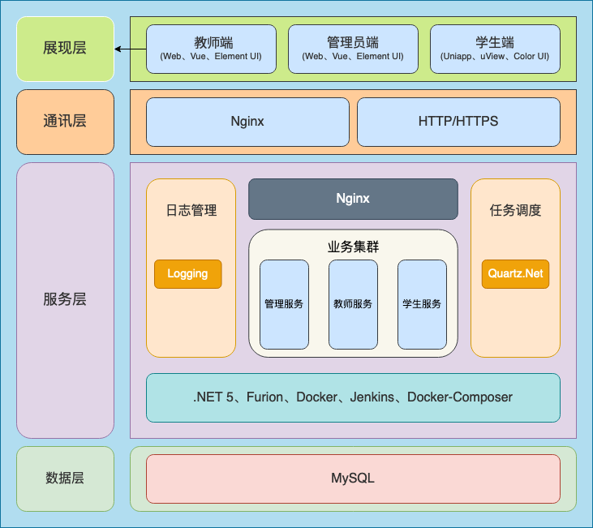
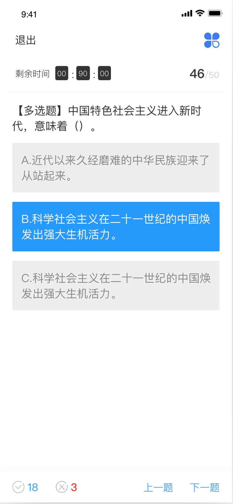
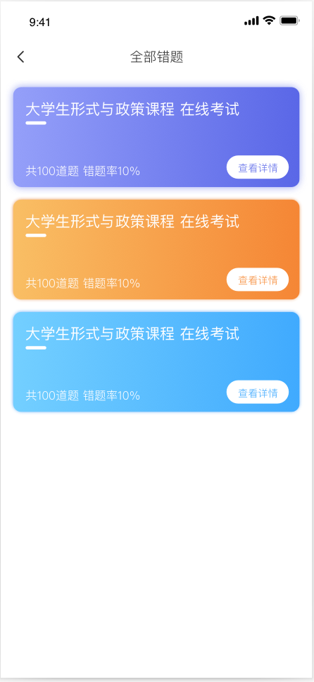
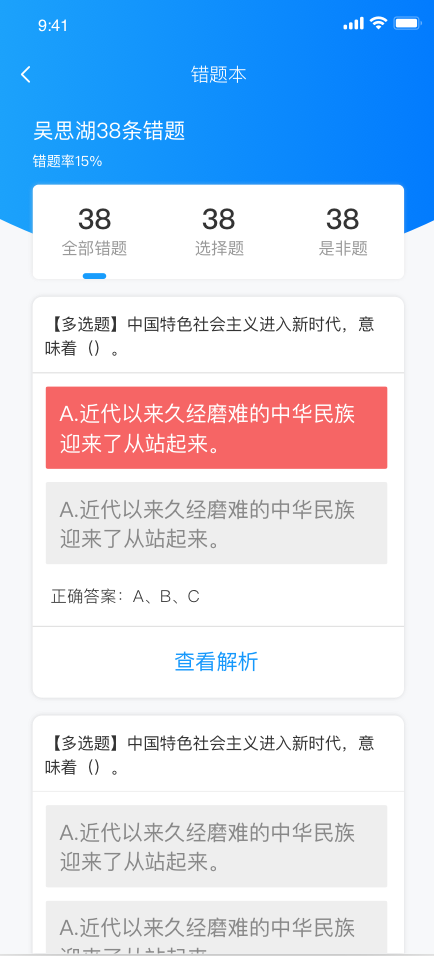

<p></p>
<p></p>

<p align="center">

</p>

<div align="center">

[](https://gitee.com/pig0224/ExamKing/stargazers) 
[](https://gitee.com/pig0224/ExamKing/members) 
[](https://github.com/pig0224/ExamKing/stargazers) 
[](https://github.com/pig0224/ExamKing/network) 
[](https://github.com/pig0224/ExamKing/blob/master/LICENSE) 

</div>

<div align="center">

考试君 - 基于 .NET 6 的 Furion 框架开发在线考试系统

</div>

## 💐 架构

<p align="center">

</p>

## 🥗 开发环境要求

- Visual Studio 2019 16.8 +
- .NET 6 SDK +
- .Net Standard 2.1 +

## 🌭 docker 部署 (推荐)

> ⚠️ 注意：请提前准备好 docker 和 docker-compose 环境！相关配置请至 ./docker/.env

```shell
# 启动
./deploy.sh start

# 停止
./deploy.sh stop

# 帮助
./deploy.sh help
```

## 🍿 本地开发
```text
1. 将 ./docker/backend/mysql/init/examkinig.sql 文件导入数据库
2. 使用 Visual Studio 打开 ./backend/ExamKing.sln 项目
3. 在 ExamKing.Database.Core 中配置的 dbsettings.Development.json 开发环境数据库
4. 在 ./frontend/admin 和 ./frontend/teacher 下分别安装依赖 npm install
5. 在 ./frontend/admin 和 ./frontend/teacher 下分别启动前端项目 npm run dev
6. 将 ./frontend/examking-app 加载至 uniapp 开发工具, 运行到手机端
```

- APP端接口文档：http://localhost:4001/
- 管理员端接口文档：http://localhost:4002/
- 教师端接口文档：http://localhost:4003/

## 🍖 预览

<p align="center">




</p>

## 🍻 贡献代码

`考试君` 遵循 `MIT` 开源协议，欢迎大家提交 `PR` 或 `Issue`。

如果要为项目做出贡献，请查看贡献指南。

## 🍚 关于作者

每日每夜的写代码、永无止境。

## 🧆 友情链接

👉 **[Furion](https://gitee.com/monksoul/Furion)** 
👉 **[Vuejs](https://cn.vuejs.org/)** 
👉 **[Element UI](https://element.eleme.cn/)** 
👉 **[uView](https://uviewui.com/)** 
👉 **[ColorUI](https://www.color-ui.com/)** 


